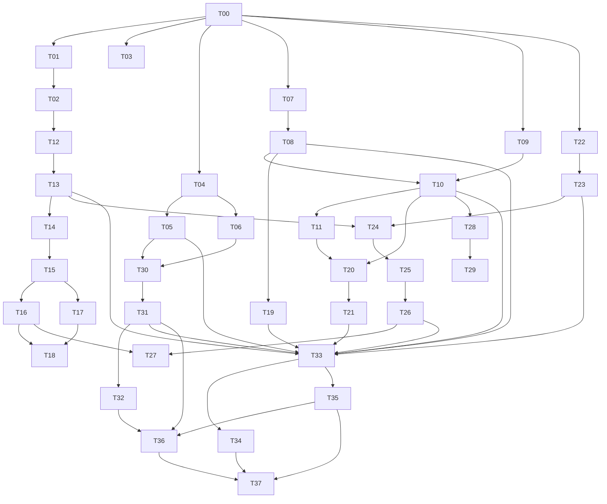

# Browser-Only Task DAG: Ungoogled Chromium To Echothink Browser

Version: 1.1
Date: 2026-05-28
Scope: Browser repository changes only

## Summary

This document defines the detailed task DAG for converting the current
Ungoogled Chromium patch/config repository into a Windows-first Echothink
Browser Alpha.

The work is browser-only. It includes patch organization, branding, defaults,
New Tab, bundled extension, Side Panel modes, login gate, device identity,
request proof helper, optional `echo://` routing, Windows packaging, and
validation. It does not include backend service implementation, gateway
implementation, search ranking, chat service implementation, workflow
orchestration, or business pages.

## Public Browser Interfaces

- Patch namespace: `patches/echothink/`, appended after inherited patches in
  `patches/series`.
- Extension package: `extensions/echothink-workspace/`.
- Side Panel modes: `chat` and `workspace_context`, persisted per profile.
- Chat scope metadata: `current_page`, `project`, `app_domain`, `task_wave`,
  `artifacts`, `organization`.
- Local device metadata: `device_id`, `installation_id`, `browser_channel`,
  `browser_version`, `enrollment_status`, `last_verified_at`.
- Extension bridge APIs: `getDeviceStatus`, `requestEnrollmentChallenge`,
  `signProofPayload`, `clearEnrollment`.
- Default New Tab route: `https://app.echothink.ai/newtab`.
- New Tab hook decision: use `HandleNewTabPageLocationOverride()` through the
  normal-profile New Tab override preference; do not use a global
  `--custom-ntp` default for Alpha.
- Default homepage route: `https://app.echothink.ai/dashboard`.
- Default search route:
  `https://search.echothink.ai/search?q={searchTerms}`.
- Default suggest route:
  `https://search.echothink.ai/suggest?q={searchTerms}`.
- Default bookmark set: Workspace, New Tab, Search, Support, Browser Download,
  and Browser Updates as defined by the T07 defaults spec.

## Parallel Execution Waves

Tasks in the same wave can run in parallel once all prerequisite tasks from
earlier waves are complete.

| Wave | Parallel Tasks | Delivery Target | Notes |
|---|---|---|---|
| W0 | T00 | M0 baseline | Establish repo truth before dependent work. |
| W1 | T01, T03, T04, T07, T09 | M0/M1/M2 discovery | Patch rules, validation, branding inventory, defaults, and New Tab hook can proceed independently after audit. |
| W2 | T02, T05, T06, T08, T19 | M0/M1 implementation | Repo structure, branding patch, assets, defaults patch, and search provider can run in parallel after their specs are ready. |
| W3 | T10, T12, T30 | M2/M3/M7 setup | New Tab implementation, extension scaffold, and Windows identity spec can proceed independently. |
| W4 | T11, T13, T20, T31 | M2/M3/M4/M7 integration | First-run shell, extension bundling, login gate spec, and packaging patch do not block each other. |
| W5 | T14, T21, T22, T28, T32 | M3/M4/M5/M6/M7 implementation | Side Panel entry, login gate, device design, optional route resolver, and Windows docs can run in parallel. |
| W6 | T15, T23, T29 | M3/M5/M6 implementation | Side Panel modes, DPAPI key storage, and invalid route fallback are independent after their parents. |
| W7 | T16, T17, T24 | M3/M5 extension work | Chat mode, Workspace Context mode, and device bridge can run together. |
| W8 | T18, T25 | M3/M5 hardening specs | Side Panel local states and proof payload spec can run after mode and bridge foundations. |
| W9 | T26 | M5 proof helper | Proof signing helper depends on proof spec. |
| W10 | T27 | M5 proof integration | Extension integration depends on Chat mode, bridge, and signing helper. |
| W11 | T33 | M7 patch validation | Full patch validation starts after all required patches land. |
| W12 | T34, T35 | M7 regression and behavior tests | Native regression and Echothink behavior tests both depend on patch validation. |
| W13 | T36 | M7 Windows smoke | Packaging smoke test depends on packaging docs, packaging patch, and behavior tests. |
| W14 | T37 | Alpha candidate | Alpha candidate depends on patch, regression, behavior, and Windows smoke reports. |

## Task DAG

| ID | Task | Prerequisites | Delivery Target |
|---|---|---|---|
| T00 | Baseline repo audit | None | M0: baseline audit note |
| T01 | Define Echothink patch discipline | T00 | M0: patch convention doc |
| T02 | Define Echothink repo structure | T01 | M0: repo skeleton plan |
| T03 | Validate inherited patch pipeline | T00 | M0: validation result |
| T04 | Define product branding inventory | T00 | M1: branding inventory |
| T05 | Implement branding patch | T01, T04 | M1: `0001-branding.patch` |
| T06 | Add Echothink visual assets | T04 | M1: asset bundle |
| T07 | Define default policy/preference set | T00 | M1: defaults spec |
| T08 | Implement default policies/preferences patch | T01, T07 | M1: `0002-default-policies-and-preferences.patch` |
| T09 | Confirm New Tab insertion point | T00 | M2: New Tab hook decision |
| T10 | Implement New Tab route and fallback | T08, T09 | M2: `0003-new-tab-and-first-run.patch` |
| T11 | Add first-run shell | T10 | M2: first-run gate shell |
| T12 | Scaffold bundled workspace extension | T02 | M3: extension skeleton |
| T13 | Add bundled extension install patch | T12 | M3: `0004-bundled-workspace-extension.patch` |
| T14 | Implement Side Panel container | T13 | M3: Side Panel opens |
| T15 | Implement Side Panel mode selector | T14 | M3: switchable panel modes |
| T16 | Implement Chat Panel shell | T15 | M3: chat mode with scope metadata |
| T17 | Implement Workspace Context shell | T15 | M3: workspace context mode |
| T18 | Add Side Panel local states | T16, T17 | M3: resilient Side Panel UX |
| T19 | Implement default search provider | T08 | M1/M3: `0005-default-search-provider.patch` |
| T20 | Define login gate local state and allowlist | T10, T11 | M4: login gate spec |
| T21 | Implement login-required startup gate | T20 | M4: `0006-login-gate.patch` |
| T22 | Define device identity and DPAPI storage | T00, T20 | M5: device identity design |
| T23 | Implement device key generation and storage | T22 | M5: `0007-device-identity.patch` |
| T24 | Implement narrow extension bridge | T13, T23 | M5: device bridge API |
| T25 | Define request proof payload and allowlist | T24 | M5: proof helper spec |
| T26 | Implement proof signing helper | T25 | M5: `0008-request-proof-helper.patch` |
| T27 | Integrate proof helper into extension calls | T16, T24, T26 | M5: proof-capable extension |
| T28 | Implement optional `echo://` resolver | T10 | M6: `0009-echo-protocol-router.patch` |
| T29 | Add invalid `echo://` fallback page | T28 | M6: safe route failure |
| T30 | Define Windows app identity and channels | T05, T06 | M7: Windows packaging spec |
| T31 | Implement Windows packaging identity patch | T30 | M7: `0010-windows-packaging-identity.patch` |
| T32 | Add Windows build/signing/smoke docs | T30, T31 | M7: Windows Alpha release docs |
| T33 | Run full patch validation | T05, T08, T10, T13, T19, T21, T23, T26, T31 | M7: patch validation report |
| T34 | Run native browser regression suite | T33 | M7: regression report |
| T35 | Run Echothink behavior tests | T33 | M7: behavior test report |
| T36 | Run Windows packaging smoke test | T31, T32, T35 | M7: Windows smoke report |
| T37 | Produce Windows Alpha candidate | T33, T34, T35, T36 | Alpha: signed/tested candidate |

## Dependency Shape

## Detailed Task Catalog

### T00: Baseline Repo Audit

Prerequisites: None

Contents:

- Confirm current Chromium pin from `chromium_version.txt`.
- Confirm repo revision from `revision.txt`.
- Inspect current patch pipeline: downloads, pruning, patch application, domain
  substitution, GN generation, build invocation.
- Identify existing hooks relevant to New Tab, search provider, first-run page,
  flags, and default settings.
- Identify current Windows build assumptions and gaps.
- Record which areas must remain inherited from Ungoogled Chromium.

Delivery criteria:

- A baseline audit note exists.
- Chromium pin and repo revision are recorded.
- Current patch tooling is documented.
- Known insertion points for New Tab/search/first-run are listed.
- No repo behavior is changed by this task.

Delivery target: M0 baseline audit note

### T01: Define Echothink Patch Discipline

Prerequisites: T00

Contents:

- Define patch naming convention for `patches/echothink/`.
- Define patch ordering rules in `patches/series`.
- Define required patch header format.
- Define which changes must be implemented through policy/preference/extension
  before native patching is allowed.
- Define forbidden changes: network stack, TLS validation, sandbox, renderer,
  downloads, history, bookmarks, password manager, cookies, DevTools.
- Define review checklist for future Chromium rebases.

Delivery criteria:

- Patch convention doc exists.
- Echothink patches are required to be small and single-purpose.
- Echothink patches are required to apply after inherited patches.
- Security-critical Chromium areas are explicitly protected.

Delivery target: M0 patch convention doc

### T02: Define Echothink Repo Structure

Prerequisites: T01

Contents:

- Define target repo paths for browser-only additions:
  `patches/echothink/`, `extensions/echothink-workspace/`, `assets/`,
  `build/windows/`, and supporting docs.
- Define expected contents for each path.
- Define when `patches/series` entries may be added.
- Define how placeholder docs and generated artifacts should be treated.

Delivery criteria:

- Repo skeleton plan exists.
- New paths are documented with ownership and purpose.
- Existing inherited patch tooling remains untouched.

Delivery target: M0 repo skeleton plan

### T03: Validate Inherited Patch Pipeline

Prerequisites: T00

Contents:

- Run existing validation for patch paths and patch metadata.
- Run existing Python tests under `utils/tests` and `devutils/tests` when
  available.
- Confirm `patches/series` remains valid before Echothink patch additions.
- Record any existing failures separately from Echothink work.

Delivery criteria:

- Validation result exists.
- Existing failures, if any, are documented as baseline issues.
- No Echothink patch work begins without knowing baseline health.

Delivery target: M0 validation result

### T04: Define Product Branding Inventory

Prerequisites: T00

Contents:

- Inventory product strings that must show `Echothink Browser`.
- Identify Windows application display name and Start Menu naming.
- Define installer name: `EchothinkBrowserSetup`.
- Identify About page and first-run copy needs.
- Define icon sizes and asset types needed for Windows Alpha.
- Preserve Chromium and Ungoogled Chromium attribution requirements.

Delivery criteria:

- Branding inventory exists.
- User-visible names are decided.
- Icon and copy requirements are listed.
- Attribution requirements are retained.

Delivery target: M1 branding inventory

### T05: Implement Branding Patch

Prerequisites: T01, T04

Contents:

- Patch the smallest stable Chromium string and resource insertion points for
  user-visible product identity.
- Update product display name to `Echothink Browser`.
- Update About/first-run browser identity surfaces.
- Preserve upstream credits and license notices.
- Avoid renaming low-level internal executable identifiers in Alpha unless
  required by packaging.

Delivery criteria:

- `0001-branding.patch` exists.
- Browser-visible identity says `Echothink Browser`.
- Upstream attribution remains visible.
- Patch applies after inherited patches.

Delivery target: M1 `0001-branding.patch`

### T06: Add Echothink Visual Assets

Prerequisites: T04

Contents:

- Add app icon assets.
- Add installer icon/assets.
- Add About/first-run visual assets.
- Store assets under the planned `assets/` structure.
- Document source, ownership, and required sizes.

Delivery criteria:

- Asset bundle exists.
- Required Windows Alpha sizes are present.
- Assets are referenced by branding/packaging specs.

Delivery target: M1 asset bundle

### T07: Define Default Policy And Preference Set

Prerequisites: T00

Contents:

- Define default homepage: `https://app.echothink.ai/dashboard`.
- Define default New Tab: `https://app.echothink.ai/newtab`.
- Define default search URL:
  `https://search.echothink.ai/search?q={searchTerms}`.
- Define default suggest URL:
  `https://search.echothink.ai/suggest?q={searchTerms}`.
- Define default bookmarks.
- Define enterprise-safe defaults that preserve native Chromium behavior.

Delivery criteria:

- Defaults spec exists.
- Defaults are browser-only and do not implement backend logic.
- Native browser primitives are preserved.

Delivery target: M1 defaults spec

### T08: Implement Default Policies And Preferences Patch

Prerequisites: T01, T07

Contents:

- Implement default homepage and preference defaults.
- Add default bookmark entries.
- Add policy/preference defaults for Echothink workspace entry.
- Avoid deep changes to browser primitives.
- Keep enterprise policy override behavior intact.

Delivery criteria:

- `0002-default-policies-and-preferences.patch` exists.
- First launch uses Echothink defaults.
- Native browser behavior remains Chromium-like.
- Patch applies after inherited patches.

Delivery target: M1 `0002-default-policies-and-preferences.patch`

### T09: Confirm New Tab Insertion Point

Prerequisites: T00

Contents:

- Inspect existing custom New Tab patch pattern.
- Identify the safest Chromium hook for external New Tab URL override.
- Confirm incognito behavior and fallback behavior.
- Record why the chosen hook is lower risk than deeper UI rewrites.

Delivery criteria:

- New Tab hook decision exists.
- The chosen hook is compatible with existing ungoogled patches.
- Risk notes are documented.

Delivery target: M2 New Tab hook decision

### T10: Implement New Tab Route And Fallback

Prerequisites: T08, T09

Contents:

- Route normal New Tab to `https://app.echothink.ai/newtab`.
- Add local fallback page for unauthenticated or unavailable state.
- Fallback page links only to login, device enrollment, diagnostics, update,
  and support/download pages.
- Ensure fallback page contains no protected business data.

Delivery criteria:

- `0003-new-tab-and-first-run.patch` exists.
- New tabs open Echothink workspace route.
- Fallback page works without backend availability.
- No protected content is embedded in the browser.

Delivery target: M2 `0003-new-tab-and-first-run.patch`

### T11: Add First-Run Shell

Prerequisites: T10

Contents:

- Add a first-run page or startup route that leads to login/enrollment.
- Ensure first-run does not present a normal general-purpose browser before
  setup.
- Keep the shell minimal and service-oriented.
- Reuse the New Tab fallback style where possible.

Delivery criteria:

- First-run gate shell exists.
- First launch leads to login/enrollment.
- Shell has no business workflow logic.

Delivery target: M2 first-run gate shell

### T12: Scaffold Bundled Workspace Extension

Prerequisites: T02

Contents:

- Create Manifest V3 extension structure.
- Add `manifest.json`, background script, Side Panel HTML/CSS/JS, content bridge,
  and asset folder.
- Declare minimum permissions: `sidePanel`, `storage`, `tabs`, `activeTab`,
  `scripting`.
- Restrict host permissions to Echothink-owned domains.

Delivery criteria:

- Extension skeleton exists at `extensions/echothink-workspace/`.
- Manifest is valid for Chromium Alpha target.
- Permissions are narrow and documented.

Delivery target: M3 extension skeleton

### T13: Add Bundled Extension Install Patch

Prerequisites: T12

Contents:

- Add patch that bundles the trusted workspace extension with the browser.
- Ensure extension is installed by default for new profiles.
- Ensure extension cannot be silently replaced by a public web-store extension.
- Preserve normal extension system behavior outside this trusted extension.

Delivery criteria:

- `0004-bundled-workspace-extension.patch` exists.
- Extension loads by default.
- Extension permissions remain narrow.
- Patch does not weaken extension permission model.

Delivery target: M3 `0004-bundled-workspace-extension.patch`

### T14: Implement Side Panel Container

Prerequisites: T13

Contents:

- Add Side Panel entry behavior through the bundled extension.
- Add toolbar or browser entry point if needed.
- Load the extension Side Panel shell.
- Keep service-rendered content separate from extension shell logic.

Delivery criteria:

- Side Panel opens from browser UI.
- Side Panel loads extension shell.
- No heavy business logic is embedded.

Delivery target: M3 Side Panel opens

### T15: Implement Side Panel Mode Selector

Prerequisites: T14

Contents:

- Add a visible top-level mode selector.
- Support exactly two Alpha modes: `chat` and `workspace_context`.
- Persist selected mode in profile-local extension storage.
- Switch modes without browser restart.

Delivery criteria:

- User can switch between Chat Panel and Workspace Context.
- Selected mode persists across restart.
- Mode state is profile-local.

Delivery target: M3 switchable panel modes

### T16: Implement Chat Panel Shell

Prerequisites: T15

Contents:

- Add Chat Panel UI shell.
- Add scope selector with Alpha scopes: current page, current project, current
  App Domain, current Task Wave, recent artifacts, organization workspace.
- Collect selected scope metadata for outbound requests.
- Support streaming response display when the remote endpoint supports it.
- Keep conversation persistence and model orchestration outside the browser.

Delivery criteria:

- Chat mode renders.
- Scope selector is visible.
- Outbound request metadata includes selected scope.
- No private key or token internals are exposed in chat UI.

Delivery target: M3 chat mode with scope metadata

### T17: Implement Workspace Context Shell

Prerequisites: T15

Contents:

- Add Workspace Context mode UI shell.
- Provide containers for current project context, App Domain context, Task Wave
  status, agent console entry, pending approvals, recent artifacts, project
  navigation, notifications, and quick actions.
- Render service-provided content where available.
- Keep business logic outside the extension.

Delivery criteria:

- Workspace Context mode renders.
- All required context sections have UI containers.
- Extension does not implement workflow/business logic.

Delivery target: M3 workspace context mode

### T18: Add Side Panel Local States

Prerequisites: T16, T17

Contents:

- Add UI states for signed out, no device identity, unauthorized scope, offline,
  and remote service error.
- Ensure both Chat Panel and Workspace Context modes can show relevant states.
- Avoid showing protected content when state is unauthenticated or unauthorized.

Delivery criteria:

- Side Panel handles setup and error states gracefully.
- Protected content is not shown in unauthorized states.
- User can recover by following login/enrollment/support links.

Delivery target: M3 resilient Side Panel UX

### T19: Implement Default Search Provider

Prerequisites: T08

Contents:

- Configure Echothink Search as default search provider.
- Configure suggest URL when suggestions are enabled.
- Prefer policy or master preferences before native omnibox changes.
- Preserve direct URL navigation.

Delivery criteria:

- `0005-default-search-provider.patch` exists.
- Omnibox search routes to Echothink Search.
- Suggest requests use Echothink suggest route when enabled.
- Omnibox internals are not deeply rewritten.

Delivery target: M1/M3 `0005-default-search-provider.patch`

### T20: Define Login Gate State And Allowlist

Prerequisites: T10, T11

Contents:

- Define local auth/device readiness flags.
- Define unauthenticated navigation allowlist.
- Define blocked-navigation behavior.
- Define how successful setup unlocks normal browsing.
- Define diagnostics and support exceptions.

Delivery criteria:

- Login gate spec exists.
- Allowlist is explicit.
- Setup completion criteria are documented.
- General browsing remains blocked before setup.

Delivery target: M4 login gate spec

### T21: Implement Login-Required Startup Gate

Prerequisites: T20

Contents:

- Open login/enrollment path on first launch.
- Check local readiness flags before normal browsing.
- Allow only approved unauthenticated destinations before setup.
- Show a local explanation page for blocked navigation.
- Restore normal Chromium browsing after setup completion.

Delivery criteria:

- `0006-login-gate.patch` exists.
- First launch forces setup.
- Arbitrary browsing is blocked before setup.
- Allowed setup/support routes still work.

Delivery target: M4 `0006-login-gate.patch`

### T22: Define Device Identity And DPAPI Storage

Prerequisites: T00, T20

Contents:

- Define local device identity fields.
- Define Windows DPAPI storage approach for private key material.
- Define non-secret metadata storage in profile preferences or local state.
- Define reset/logout behavior.
- Define bridge boundaries so extension JavaScript never sees private key
  material.

Delivery criteria:

- Device identity design exists.
- DPAPI is selected for Alpha.
- Private key exposure boundaries are documented.
- Reset behavior is documented.

Delivery target: M5 device identity design

### T23: Implement Device Key Generation And Storage

Prerequisites: T22

Contents:

- Generate asymmetric keypair per browser installation.
- Store private key with Windows DPAPI.
- Store non-secret device metadata.
- Persist identity across browser restart.
- Support explicit reset of local enrollment state.

Delivery criteria:

- `0007-device-identity.patch` exists.
- Device identity persists across restart.
- Private key is protected by DPAPI.
- Reset removes local enrollment state.

Delivery target: M5 `0007-device-identity.patch`

### T24: Implement Narrow Extension Bridge

Prerequisites: T13, T23

Contents:

- Expose only required bridge methods to bundled extension:
  `getDeviceStatus`, `requestEnrollmentChallenge`, `signProofPayload`,
  `clearEnrollment`.
- Ensure private key is never exposed to extension JavaScript.
- Restrict bridge use to the bundled workspace extension.
- Define errors for missing device, locked key, unsupported platform, and reset.

Delivery criteria:

- Device bridge API exists.
- Bundled extension can check device status and request signatures.
- Private key cannot be read by extension code.
- Unauthorized extensions cannot access bridge methods.

Delivery target: M5 device bridge API

### T25: Define Request Proof Payload And Allowlist

Prerequisites: T24

Contents:

- Define canonical proof payload fields: method, URL, timestamp, nonce if
  supplied, and access token hash if required.
- Define Echothink-domain signing allowlist.
- Define rejection behavior for third-party destinations.
- Keep replay protection and proof validation outside the browser.

Delivery criteria:

- Proof helper spec exists.
- Canonical payload shape is documented.
- Domain allowlist is explicit.
- Browser-side responsibilities are limited to signing.

Delivery target: M5 proof helper spec

### T26: Implement Proof Signing Helper

Prerequisites: T25

Contents:

- Implement browser-side signing helper using local device private key.
- Accept only canonical payloads from authorized bridge caller.
- Sign only allowed Echothink destinations.
- Return signature/proof result without exposing private key.
- Reject malformed payloads and non-allowed destinations.

Delivery criteria:

- `0008-request-proof-helper.patch` exists.
- Helper signs valid Echothink payloads.
- Helper rejects third-party URLs.
- Helper does not alter Chromium network/TLS behavior.

Delivery target: M5 `0008-request-proof-helper.patch`

### T27: Integrate Proof Helper Into Extension Calls

Prerequisites: T16, T24, T26

Contents:

- Update extension API calls to request proof signatures when needed.
- Attach proof headers/metadata for Echothink API/chat calls.
- Handle signing errors locally in the Side Panel.
- Ensure private key never enters extension state or logs.

Delivery criteria:

- Extension can make proof-capable Echothink requests.
- Signing failures show recoverable UI state.
- Extension logs do not expose secrets.

Delivery target: M5 proof-capable extension

### T28: Implement Optional Echo Protocol Resolver

Prerequisites: T10

Contents:

- Add route resolver for known `echo://` routes.
- Map routes to HTTPS Echothink app URLs.
- Keep resolver as navigation helper only.
- Do not bypass backend authorization or device proof.

Delivery criteria:

- `0009-echo-protocol-router.patch` exists.
- Valid `echo://` routes navigate to expected HTTPS URLs.
- Resolver does not expose protected content.

Delivery target: M6 `0009-echo-protocol-router.patch`

### T29: Add Invalid Echo Route Fallback

Prerequisites: T28

Contents:

- Add local fallback page for invalid or unsupported `echo://` routes.
- Show clear route error without leaking resource data.
- Provide safe navigation back to workspace or support.

Delivery criteria:

- Invalid route fallback exists.
- Invalid routes fail safely.
- No protected data appears on error page.

Delivery target: M6 safe route failure

### T30: Define Windows App Identity And Channels

Prerequisites: T05, T06

Contents:

- Define Windows application display name and Start Menu name.
- Define installer naming: `EchothinkBrowserSetup`.
- Define channel names: Canary, Dev, Beta, Stable, Enterprise Stable.
- Define what branding is required for Alpha versus Beta.
- Define update-channel metadata expected by browser packaging.

Delivery criteria:

- Windows packaging spec exists.
- Installer and channel names are decided.
- Alpha/Beta identity tradeoff is explicit.

Delivery target: M7 Windows packaging spec

### T31: Implement Windows Packaging Identity Patch

Prerequisites: T30

Contents:

- Add patch for Windows package/application identity surfaces.
- Connect installer/app identity to branding assets where possible.
- Expose channel information in appropriate browser surfaces.
- Avoid risky executable/internal renames for Alpha unless required.

Delivery criteria:

- `0010-windows-packaging-identity.patch` exists.
- Windows app identity shows Echothink Browser.
- Channel identity is visible or documented.
- Patch applies after branding/assets decisions.

Delivery target: M7 `0010-windows-packaging-identity.patch`

### T32: Add Windows Build, Signing, And Smoke Docs

Prerequisites: T30, T31

Contents:

- Add Windows build notes.
- Add signing workflow notes.
- Add update-channel notes.
- Add smoke test procedure.
- Add release checklist for Alpha candidate.

Delivery criteria:

- Windows Alpha release docs exist.
- A developer can build, package, sign, and smoke test from the docs.
- Smoke test includes launch, branding, New Tab, Side Panel, search, restart,
  and uninstall.

Delivery target: M7 Windows Alpha release docs

### T33: Run Full Patch Validation

Prerequisites: T05, T08, T10, T13, T19, T21, T23, T26, T31

Contents:

- Validate `patches/series` ordering.
- Apply inherited patches plus Echothink patches to pinned Chromium source.
- Run patch validation utilities.
- Record failures by patch ID.
- Confirm Echothink patches remain ordered after inherited patches.

Delivery criteria:

- Patch validation report exists.
- All required Alpha patches apply cleanly.
- Any failures are tied to explicit patch IDs.

Delivery target: M7 patch validation report

### T34: Run Native Browser Regression Suite

Prerequisites: T33

Contents:

- Validate native tabs, windows, popups, history, downloads, bookmarks, password
  manager, cookies, local storage, TLS, DevTools, and extension loading.
- Confirm Echothink changes did not replace Chromium primitives.
- Record regressions with severity and owning patch.

Delivery criteria:

- Regression report exists.
- No blocker regressions remain.
- Chromium-native ownership is preserved.

Delivery target: M7 regression report

### T35: Run Echothink Behavior Tests

Prerequisites: T33

Contents:

- Verify Echothink branding.
- Verify New Tab route and fallback.
- Verify default search and suggest route.
- Verify Side Panel opens.
- Verify Chat and Workspace Context modes.
- Verify chat scope metadata.
- Verify login gate and allowlist behavior.
- Verify device identity persistence.
- Verify proof helper signs only allowed Echothink URLs.
- Verify optional `echo://` routes if included.

Delivery criteria:

- Behavior test report exists.
- Required Alpha browser behaviors pass.
- Any deferred behavior is explicitly marked non-blocking.

Delivery target: M7 behavior test report

### T36: Run Windows Packaging Smoke Test

Prerequisites: T31, T32, T35

Contents:

- Install browser on clean Windows machine.
- Launch from Start Menu.
- Verify application name and icon.
- Verify New Tab route.
- Verify Side Panel opens and mode persists after restart.
- Verify default search.
- Verify uninstall path.
- Record install/update-channel/signing observations.

Delivery criteria:

- Windows smoke report exists.
- Install, launch, restart, and uninstall pass.
- New Tab, Side Panel, and search pass after install.
- Blocking packaging issues are resolved or documented.

Delivery target: M7 Windows smoke report

### T37: Produce Windows Alpha Candidate

Prerequisites: T33, T34, T35, T36

Contents:

- Package the validated Windows Alpha candidate.
- Attach patch validation, regression, behavior, and smoke reports.
- Record exact Chromium pin, repo revision, patch list, channel, and build
  timestamp.
- Mark known limitations and deferred work.

Delivery criteria:

- Windows Echothink Browser Alpha candidate exists.
- Candidate is traceable to source revision and patch list.
- Validation reports are attached.
- No blocker browser-side acceptance criteria remain open.

Delivery target: Alpha signed/tested candidate

## Test Plan

- Patch validation: every Echothink patch applies after inherited patches;
  `patches/series` ordering is deterministic.
- Native browser regression: Chromium primitives remain native and unchanged in
  behavior.
- Workspace shell tests: New Tab, default search, bundled extension, Side Panel
  mode switching, persisted mode, and chat scope metadata.
- Login/device tests: first-run gate, unauthenticated allowlist,
  blocked-navigation page, DPAPI persistence, and private-key bridge boundary.
- Proof helper tests: signs only Echothink-domain canonical payloads and refuses
  third-party signing.
- Windows smoke tests: install, launch, branding, New Tab, Side Panel, search,
  restart persistence, and uninstall.

## Alpha Acceptance Criteria

- Existing Ungoogled Chromium patch pipeline still works.
- Echothink patches are isolated under `patches/echothink/`.
- Browser is visibly branded as Echothink Browser.
- New Tab routes to Echothink workspace.
- Side Panel is available through bundled trusted extension.
- Side Panel has Chat Panel and Workspace Context modes.
- Chat Panel supports user-selected scope metadata.
- Default search provider is Echothink Search.
- Login gate prevents general browsing before setup.
- Device identity can be generated and stored with Windows DPAPI.
- Request proof signing is available to the bundled extension only through a
  narrow API.
- Native Chromium primitives still pass regression checks.
- Windows packaging path is documented and smoke-tested.

## Assumptions

- Alpha may keep Chromium internal executable naming if needed to reduce patch
  risk; public Beta should complete visible Echothink application identity.
- Side Panel is delivered first through a bundled Manifest V3 extension, not
  native Chromium UI.
- DPAPI is the Alpha secure-storage target; TPM-backed storage is deferred.
- `echo://` is optional and never a security boundary.
- Backend implementation is not part of this DAG.
